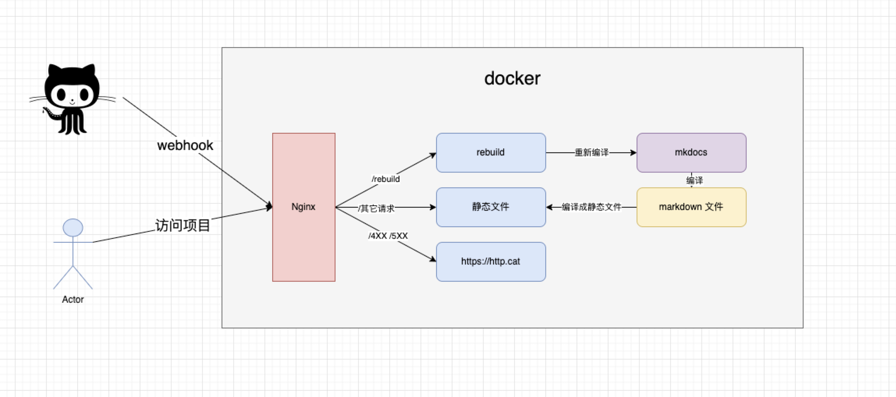

## notes-docker

notes 项目的 doceker 镜像，一键部署，部署之后通过浏览器即可访问服务。

样式参考：[https://note.sunfeilong.com](https://note.sunfeilong.com)

镜像里面做了什么事情？看下图：



**Nginx**：镜像里面会启动一个 `Nginx` 做反向代理。

* 配置 `/rebuild` 的请求到 `rebuild` 服务。
* 配置 `/*` 的请求到静态资源。
* 配置 `4XX 5XX` 的请求到 [https://http.cat/](https://http.cat/)

**构建服务**: 把 `Markdown` 文件编译成静态页面，即 `html` 文件。
* 是一个 `Python` 的 `Web` 项目，收到请求后执行 `build.sh` 脚本。
* 该服务是为了接收 `Github` 的回调，当项目有新提交的时候调用该接口。
* 为了安全接口调用是进行了简单的验证，当 `URL` 中包含 【auth_key】的时候验证才会通过，验证不通过不会执行重新构建操作。

**Github 回调设置**：在仓库的 `Settings -> Webhooks` 中添加 `Webhooks` 即可。 示例配置如下：

```shell
http://localhost:8000/rebuild?auth_key=00000000839a8e6886ab5951d76f411475428afc90947ee320161bbf18eb6048
```

### 怎么使用？

**第一步**：创建自己的笔记仓库

这一步需要先执行，后面的配置会用到笔记仓库的地址。

可以 Fork 模版项目： `https://github.com/LanSeTianYe/Notes-Template`

**第二步**：修改配置

全局搜索：`TODO`，会看到需要修改的地方。


|   配置标签   |                               描述                               |    位置    |
| :----------: | :--------------------------------------------------------------: | :--------: |
| 【仓库地址】 | 笔记文件的仓库地址，拉取之后把里面的 markdown 文件编译成静态文件 |  build.sh  |
| 【auth_key】 |                  调用 rebuild 接口时的验证信息                  |  start.sh  |
|     ...     |                其它的就不介绍了，在文件里面有注释                | mkdocs.yml |

**第三步**：构建镜像

```shell
# 拉取该仓库
git pull https://github.com/LanSeTianYe/Notes-Docker.git
# 构建镜像
docker build -t note:0.0.1 .
```

**第四步**：运行镜像

```shell
# -p 8000:80 绑定宿主机的 8000 端口到容器的 80 端口
docker run -d --name note -p 8000:80 note:0.0.1
```

**第五步**：访问项目。

**项目地址**：[http://localhost:8000](http://localhost:8000)

第一次访问的时候会 404，这是因为还没有构建生成静态文件。

**构建项目**：请求下面地址即可构建项目，请求之后稍等一会儿。

```
http://localhost:8000/rebuild?auth_key=00000000839a8e6886ab5951d76f411475428afc90947ee320161bbf18eb6048
```

最终：再次访问 [http://localhost:8000](http://localhost:8000) 即可看到效果。

### 其它

* 项目的日志在 `/home/logs` 目录下。
